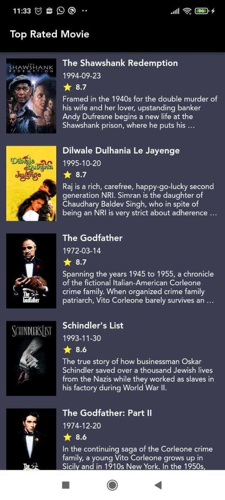
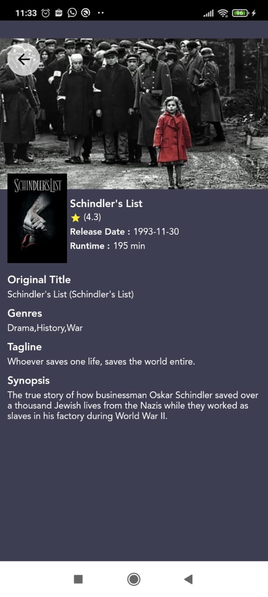

# Movie App

Latihan parsing API menggunakan Dio untuk call API dan State management Riverpod,
menggunakan ChangeNotifier untuk update Widget UI

Aplikasi dibuat menggunakan Flutter versi 2.10.5

 Selamat Mempelajari dan semoga bermanfaat :D

 Screen Shoot Aplikasi
 
 